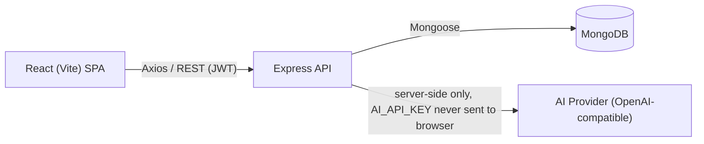
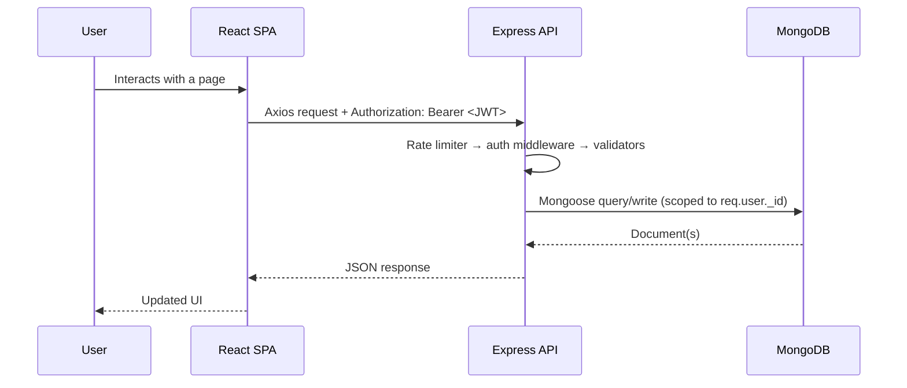
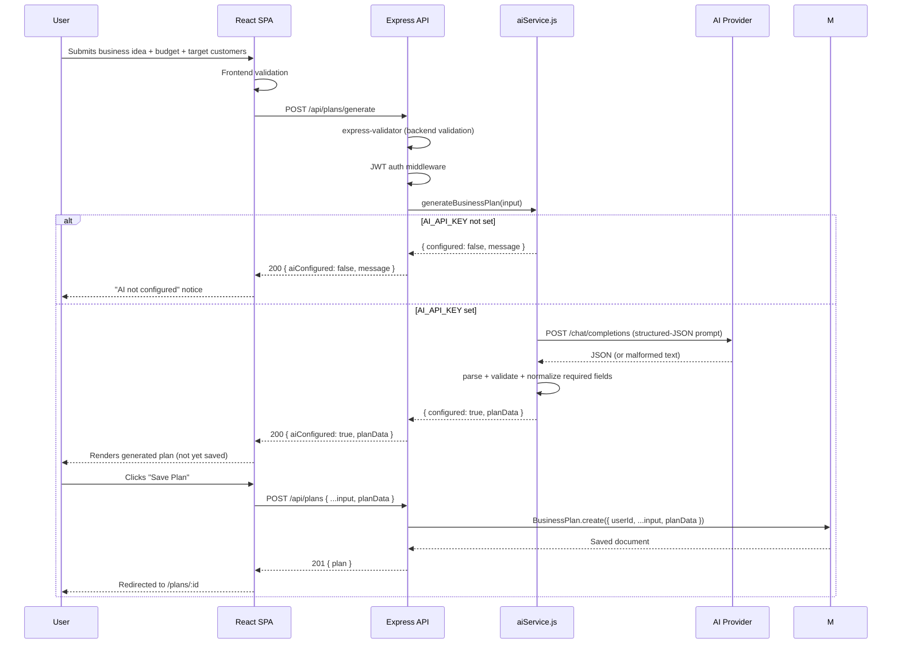

# StartupHub — Architecture

## High-level overview

StartupHub is a standard three-tier MERN application: a React SPA talks to
an Express REST API over HTTPS/JSON, the API talks to MongoDB via Mongoose,
and a dedicated service module talks to an external AI provider on the
API's behalf. The browser never talks to MongoDB or the AI provider
directly.



## Request flow (general)



## AI business-plan generation flow



## Backend layering

```
routes/        → only route definitions + which middleware/validators apply
controllers/    → HTTP request/response handling; calls services & models
services/       → business logic that isn't pure CRUD (aiService.js)
models/         → Mongoose schemas (User, BusinessPlan)
middleware/     → auth (JWT), centralized error handler, rate limiting
validators/     → express-validator rule sets, reused between routes
utils/          → small stateless helpers (JWT signing)
```

This separation means, for example, that swapping the AI provider only
touches `services/aiService.js` — no controller, route, or model changes
are needed.

## Frontend layering

```
api/           → single Axios instance (base URL, JWT interceptor, 401 handling)
services/      → one function per API call (authService, planService) — 
                 pages never call Axios directly
context/       → AuthContext (user/token/loading), ToastContext
hooks/         → useAuth (re-export of AuthContext for the "hooks/" convention)
layouts/       → PublicLayout (marketing nav+footer), DashboardLayout (app nav+sidebar)
components/    → reusable, presentation-focused pieces (Button, Card, PlanCard, ...)
pages/         → route-level screens; compose components + services + context
utils/         → formatters.js, pdfGenerator.js (pure functions, no side effects
                 beyond triggering a download)
```

## Data ownership & security model

- Every `BusinessPlan` document has a `userId` field.
- Every plan-scoped controller function (`getPlanById`, `updatePlan`,
  `deletePlan`, `duplicatePlan`, `regeneratePlan`) loads the plan and then
  checks `plan.userId.toString() === req.user._id.toString()` before doing
  anything else — returning `403` immediately if it doesn't match.
- The JWT itself only encodes a user id; `protect` middleware re-fetches
  the user from MongoDB on every request, so a deleted/deactivated user's
  token stops working immediately rather than staying valid until expiry.
- `AI_API_KEY`, `MONGODB_URI`, and `JWT_SECRET` only ever exist in
  `server/.env` — they are never sent to, or readable by, the frontend.

## Why these choices

- **Mongoose `Mixed` type for `planData`:** the AI's JSON shape is
  normalized by `aiService.js` before it ever reaches the model layer, but
  keeping the DB field itself as `Mixed` means a slightly-richer AI
  response (an extra field, a nested object) doesn't get silently dropped
  by a rigid sub-schema.
- **A separate `generate` vs `create` endpoint:** generating a plan is the
  expensive, rate-limited, non-idempotent operation; saving it is a cheap
  DB write. Splitting them lets the user regenerate a few times before
  committing to a save, without creating throwaway database rows for each
  attempt.
- **`app.js` / `server.js` split:** `app.js` exports a pure Express app
  with no side effects, which is what you'd import into a test suite
  (e.g. with Supertest) without also opening a real DB connection or
  starting a listener — `server.js` is the only file that does that.
